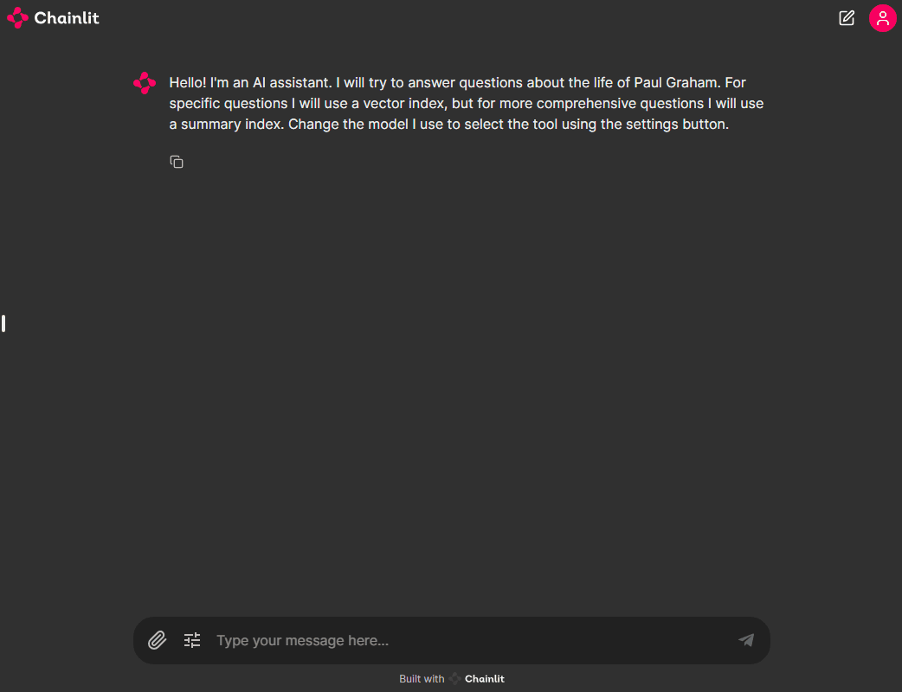

# Azure AI studio for RAG

In this repository, you will learn how you can use models deployed in Azure AI studio to use the best model for the right job and consume the greatest innovation.

## Deploy

We are using infrastructure as code to deploy the required models. The following script deploys different models using Serverless API endpoints. 

* Cohere Embed V3 - Multilingual
* Cohere Command R+
* Mistral-Large
* Mistral-Small
* Phi-3-Mini 128K
* OpenAI GPT-4

Notice that serverless API endpoints are currently supported on `eastus2` and `swidencentral`.

```bash
RESOURCE_GROUP="santiagxf-azurei-raghack-dev"
LOCATION="eastus2" 

cd .cloud

az group create --location $LOCATION --name $RESOURCE_GROUP
az deployment group create --resource-group $RESOURCE_GROUP --template-file deploy.json
```

Once deployment is done, create an `.env` file with the endpoints URLs and keys like the following one:

__.env__

```bash
export AZURE_AI_COHERE_CMDR_ENDPOINT_URL="https://my_awesome_endpoint-serverless.eastus2.inference.ai.azure.com"
export AZURE_AI_COHERE_CMDR_ENDPOINT_KEY="my_awesome_key"
export AZURE_AI_MISTRAL_ENDPOINT_URL="https://my_awesome_endpoint-serverless.eastus2.inference.ai.azure.com"
export AZURE_AI_MISTRAL_ENDPOINT_KEY="my_awesome_key" 
export AZURE_AI_MISTRAL_SMALL_ENDPOINT_URL="https://my_awesome_endpoint-serverless.eastus2.inference.ai.azure.com"
export AZURE_AI_MISTRAL_SMALL_ENDPOINT_KEY="my_awesome_key" 
export AZURE_AI_PHI3_MINI_ENDPOINT_URL="https://my_awesome_endpoint-serverless.eastus2.inference.ai.azure.com"
export AZURE_AI_PHI3_MINI_ENDPOINT_KEY="my_awesome_key" 
export AZURE_AI_COHERE_EMBED_ENDPOINT_URL="https://my_awesome_endpoint-serverless.eastus2.inference.ai.azure.com"
export AZURE_AI_COHERE_EMBED_ENDPOINT_KEY="my_awesome_key" 
```

## Run

Use `.devcontainer` to spin off a GitHub codespace to run the examples. This will install all the packages required. This example currently build the packages `llama-index-embeddings-azure-inference` and `llama-index-llms-azure-inference` from source in LlamaIndex.

This repository has the following examples:

* [llama_index_selector.ipynb](llama_index_selector.ipynb): It explains how multiple LLMs can be use for data generation, evaluation, and for specific tasks like tool selection. It shows how to instrument your code using PromptFlow.
* [src/app.py](src/app.py): A chainlit project that allows you to play with index we built in the previous example. Use the notebook to learn about the technique and the approach. You can use this playground for testing the idea.

To use chainlit, run the following command:

```bash
source .env
cd src
chainlit run app.py -w
```

A browser will open in `http://localhost:8000`.


